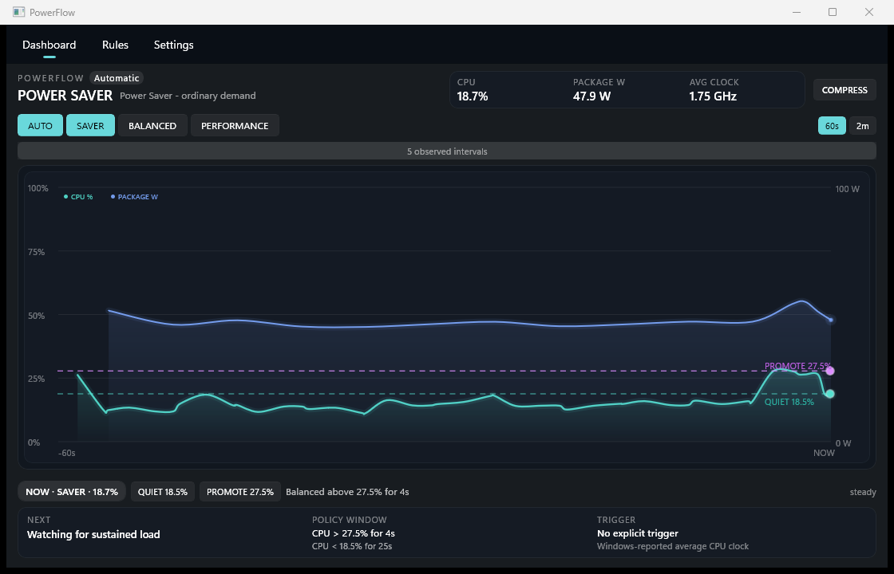

# PowerFlow

**Windows power plans, without the whiplash.**

PowerFlow is a tiny, tray-first Windows power-plan traffic cop. **Saver sips. Balanced cruises. Performance gets the green light.** Games can hold Performance until they actually leave, while ordinary desktop use settles back down without turning your power plan into a metronome.


> [!WARNING]
> **Vibe Coding Alert:** AI was absolutely in the loop. The power-plan decisions are not powered by vibes. The current build has deterministic policy tests, a red-to-green regression proof for the last WinUI crash, a clean Release build, native plan-switch verification, and a live tray/dashboard acceptance run. Vibes proposed. Tests disposed.

## What it does

PowerFlow controls the three Windows power states you already understand:

- **Power Saver** — the resting state when the machine is quiet.
- **Balanced** — sustained CPU demand earns more headroom without jumping straight to maximum power.
- **High Performance** — games and explicit manual overrides can latch here until their real release condition occurs.

The important part is not the three buttons. It is the behavior between them: hysteresis, hold windows, cooldown, game lifecycle tracking, manual latches, and a verified Windows power-plan switch at the end of every decision.

## The cockpit, not the control room

PowerFlow lives in the tray. The full dashboard only appears when invited.

The dashboard is trajectory-first: recent behavior, **NOW**, policy pressure, thresholds, and actual state transitions share one compact field. Hover gives local detail. Click expands context in place. Rules and settings stay out of the way until you ask for them.

### Three levels, one instrument

- **Hover glance - 320 x 176.** Tiny, non-activating, and just enough: state, one telemetry line, trajectory, next action.
- **Compressed - 760 x 440.** The default working instrument. Same trajectory and policy anchors, readable rather than miniaturized.
- **Expanded - 1120 x 720.** The same instrument grows into a full cockpit with richer context, Rules, and Settings. No surprise card-wall sequel.



_Screenshots are captured directly from the PowerFlow window handle, not from screen coordinates._

Compressed and expanded modes evolve through a short bounded resize/content transition. Reduced Motion turns the flourish off without changing the information hierarchy. Manual resizing maps onto the same two dashboard modes.

Telemetry also survives a closed dashboard without becoming its own space heater:

- visible dashboard or tray instrument: **1 second** rich telemetry cadence;
- hidden normal desktop: **5 seconds** rich continuity cadence;
- hidden game/manual latch: rich visualization telemetry **off**;
- one bounded in-memory history; no continuous telemetry log writes.

## Safety model

PowerFlow selects existing Windows power plans. It does **not** rewrite voltages, BIOS settings, fan curves, or the internals of your power plans.

- one user process; no Windows service;
- normal per-user startup, not a privileged scheduled task;
- plan changes use `PowerSetActiveScheme` and are read back for verification;
- `--preview` is intentionally read-only and cannot change the real Windows power plan;
- abnormal recovery prefers a safe neutral state rather than blindly forcing Performance.

## Build it

The current source targets x64 Windows with:

- .NET 8;
- `net8.0-windows10.0.19041.0`;
- minimum Windows platform version `10.0.17763.0`;
- Microsoft Windows App SDK `2.4.0`;
- unpackaged WinUI 3 (`WindowsPackageType=None`).

```powershell
dotnet restore PowerFlow.sln
dotnet test PowerFlow.sln -c Release
dotnet build PowerFlow.sln -c Release
```

Run tray-first:

```powershell
.\src\PowerFlow.App\bin\Release\net8.0-windows10.0.19041.0\win-x64\PowerFlow.App.exe --background
```

Open the dashboard through the running instance:

```powershell
.\src\PowerFlow.App\bin\Release\net8.0-windows10.0.19041.0\win-x64\PowerFlow.App.exe --dashboard
```

Read-only visual preview:

```powershell
.\src\PowerFlow.App\bin\Release\net8.0-windows10.0.19041.0\win-x64\PowerFlow.App.exe --preview
```

## Configuration

Per-user configuration lives at:

```text
%LOCALAPPDATA%\PowerFlow\config.json
```

The UI exposes resting state, CPU promotion/quiet thresholds and hold times, game/app rules, startup behavior, theme, reduced motion, and power-plan mappings.

`AVG CLOCK` is Windows-reported average processor frequency across active processors. It is a power-state diagnostic, not the peak boost clock of the fastest core.

## Current qualification

The September 9, 2026 candidate passed:

- **169/169 automated tests** across Core, Windows, and App;
- Release build with **0 warnings / 0 errors**;
- WinUI dynamic-theme crash regression proven **red -> green** against the pre-fix commit;
- real production `WindowsPowerPlanController` switch **Power Saver -> Balanced -> Power Saver**, with Windows confirming each active GUID;
- hidden startup with **no dashboard window**;
- dashboard opens compressed at **760 x 440**, evolves to **1120 x 720** expanded, and collapses cleanly back to **760 x 440**;
- **0 new PowerFlow crash events** during the live acceptance run;
- exactly **one** background PowerFlow process afterward.

The evidence is recorded in [`docs/acceptance/reference-host-acceptance.md`](docs/acceptance/reference-host-acceptance.md).

## Status

**Working beta.** The core policy, background continuity, real plan switching, tray lifecycle, and dashboard are qualified. Long-duration power-overhead and real-game frame-time soak remain release-hardening work rather than claims hidden behind a shiny README.

## Why PowerFlow?

Because "High Performance forever" is wasteful, "Power Saver forever" is annoying, and a utility whose monitoring costs more power than it saves has misunderstood the assignment.

PowerFlow was inspired by the useful three-state idea in [eliosteva/PowerPlanManager](https://github.com/eliosteva/PowerPlanManager), then rebuilt around hysteresis, game latching, explainable transitions, strict background-overhead rules, and a modern native Windows UI.