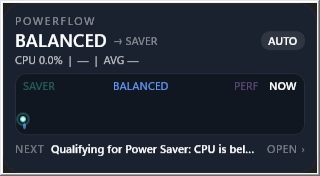
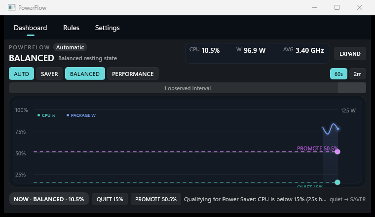

# PowerFlow

**Windows power plans, without the whiplash.**

PowerFlow is a tiny, tray-first Windows power-plan traffic cop. **Saver sips. Balanced cruises. Performance gets the green light.** Games can hold Performance until they actually leave, while ordinary desktop use settles back down without turning your power plan into a metronome.



*Tiny when it should be tiny. The tray hover is the glanceable instrument, not a dashboard wearing a fake moustache.*

> [!WARNING]
> **Vibe Coding Alert:** AI was absolutely in the loop. The power-plan decisions are not powered by vibes. The current build has deterministic policy tests, a red-to-green regression proof for the last WinUI crash, a clean Release build, native plan-switch verification, and a live tray/dashboard acceptance run. Vibes proposed. Tests disposed.

## What it does

PowerFlow controls the three Windows power states you already understand:

- **Power Saver** — the resting state when the machine is quiet.
- **Balanced** — sustained CPU demand earns more headroom without jumping straight to maximum power.
- **High Performance** — games and explicit manual overrides can latch here until their real release condition occurs.

The important part is not the three buttons. It is the behavior between them: hysteresis, hold windows, cooldown, game lifecycle tracking, manual latches, and a verified Windows power-plan switch at the end of every decision.

## The cockpit, not the control room

PowerFlow lives in the tray. The full dashboard only appears when invited.

The dashboard is trajectory-first: recent behavior, **NOW**, policy pressure, thresholds, and actual state transitions share one compact field. Hover gives local detail. Click expands context in place. Rules and settings stay out of the way until you ask for them.

### Four levels, one instrument

PowerFlow no longer treats responsive design as “pick one of two rectangles and hope.” The same trajectory/state/policy instrument continuously reflows as real window space changes:

- **Hover glance — 320 × 176.** Non-activating and deliberately tiny: state, one telemetry line, mini trajectory, next action.
- **Compressed — 760 × 440.** The default working instrument. Compact telemetry replaces the larger metric card; secondary context stays out of the way.
- **Expanded — fluid, with 1120 × 720 as the canonical working size.** Padding, graph height, reason width, typography, hover-lens width, and context spacing grow continuously with the actual window. Dragging from 980 × 620 through 1320 × 820 is not a binary layout swap.
- **Full screen — a real WinUI full-screen presenter.** The same instrument grows to full-density context rather than stretching empty chrome. On the acceptance machine it occupies 1920 × 1080.




_Screenshots are captured with `PrintWindow` from PID-owned PowerFlow HWNDs. No desktop-coordinate crop cosplay._

The **EXPAND → FULL SCREEN → RESTORE** path uses the same responsive layout engine throughout. Manual resizing also feeds the same engine on every size change. Reduced Motion removes the flourish, not the information hierarchy.
Telemetry also survives a closed dashboard without becoming its own space heater:

- visible dashboard or tray instrument: **1 second** rich telemetry cadence;
- hidden normal desktop: **5 seconds** rich continuity cadence;
- hidden game/manual latch: rich visualization telemetry **off**;
- one bounded in-memory history; no continuous telemetry log writes.

## Safety model

PowerFlow selects existing Windows power plans. It does **not** rewrite voltages, BIOS settings, fan curves, or the internals of your power plans.

- one user process; no Windows service;
- normal per-user startup, not a privileged scheduled task;
- plan changes use `PowerSetActiveScheme` and are read back for verification;
- `--preview` is intentionally read-only and cannot change the real Windows power plan;
- abnormal recovery prefers a safe neutral state rather than blindly forcing Performance.

## Build it

The current source targets x64 Windows with:

- .NET 8;
- `net8.0-windows10.0.19041.0`;
- minimum Windows platform version `10.0.17763.0`;
- Microsoft Windows App SDK `2.4.0`;
- unpackaged WinUI 3 (`WindowsPackageType=None`).

```powershell
dotnet restore PowerFlow.sln
dotnet test PowerFlow.sln -c Release
dotnet build PowerFlow.sln -c Release
```

Run tray-first:

```powershell
.\src\PowerFlow.App\bin\Release\net8.0-windows10.0.19041.0\win-x64\PowerFlow.App.exe --background
```

Open the dashboard through the running instance:

```powershell
.\src\PowerFlow.App\bin\Release\net8.0-windows10.0.19041.0\win-x64\PowerFlow.App.exe --dashboard
```

Read-only visual preview:

```powershell
.\src\PowerFlow.App\bin\Release\net8.0-windows10.0.19041.0\win-x64\PowerFlow.App.exe --preview
```

## Configuration

Per-user configuration lives at:

```text
%LOCALAPPDATA%\PowerFlow\config.json
```

The UI exposes resting state, CPU promotion/quiet thresholds and hold times, game/app rules, startup behavior, theme, reduced motion, and power-plan mappings.

`AVG CLOCK` is Windows-reported average processor frequency across active processors. It is a power-state diagnostic, not the peak boost clock of the fastest core.

## Current qualification

The September 9, 2026 candidate passed:

- **179/179 automated tests** across Core, Windows, and App;
- Release build with **0 warnings / 0 errors**;
- WinUI dynamic-theme crash regression proven **red -> green** against the pre-fix commit;
- real production `WindowsPowerPlanController` switch **Power Saver -> Balanced -> Power Saver**, with Windows confirming each active GUID;
- hidden startup with **no dashboard window**;
- live responsive matrix verified at **760 × 440, 980 × 620, 1120 × 720, 1320 × 820, and 1600 × 900**;
- real full-screen presenter verified at **1920 × 1080**;
- real tray-hover popup verified at **320 × 176**;
- popup, compressed, and full-screen release images captured directly from PowerFlow-owned HWNDs;
- **0 new PowerFlow crash events** during the live acceptance run;
- exactly **one** background PowerFlow process afterward.

The evidence is recorded in [`docs/acceptance/reference-host-acceptance.md`](docs/acceptance/reference-host-acceptance.md).

## Status

**Working beta.** The core policy, background continuity, real plan switching, tray lifecycle, and dashboard are qualified. Long-duration power-overhead and real-game frame-time soak remain release-hardening work rather than claims hidden behind a shiny README.

## Why PowerFlow?

Because "High Performance forever" is wasteful, "Power Saver forever" is annoying, and a utility whose monitoring costs more power than it saves has misunderstood the assignment.

PowerFlow was inspired by the useful three-state idea in [eliosteva/PowerPlanManager](https://github.com/eliosteva/PowerPlanManager), then rebuilt around hysteresis, game latching, explainable transitions, strict background-overhead rules, and a modern native Windows UI.