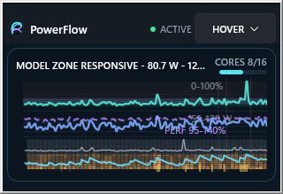
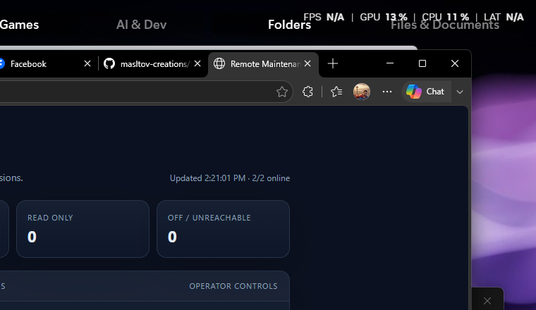

# PowerFlow

**A tray-first Windows CPU power manager that tries to be fast when it matters — and pleasantly boring when it does not.**

PowerFlow watches live Windows telemetry, learns how the machine behaves, and applies reversible Windows processor-policy changes to move between efficient and responsive operating profiles. It stays above the firmware line: no BIOS writes, no voltage tuning, no fan curves, no mystery overclocking rituals.


## Why PowerFlow exists

Windows already has power plans. Modern CPUs already have sophisticated firmware. PowerFlow does not try to replace either one.

It adds a control layer that can answer a more useful question in real time: **how much performance does this workload actually need right now?**

PowerFlow combines:

- live CPU demand and runnable-queue pressure;
- core-parking and processor-performance telemetry when Windows exposes it;
- package power when the platform exposes the RAPL-backed Windows counter;
- per-app importance rules for latency-sensitive workloads;
- measured machine behavior from an integrated baseline;
- reversible Windows power-plan and processor-policy changes.

The aim is simple: keep the machine responsive without pinning it to maximum aggression all day. Your fans may still have opinions, but they get fewer speaking opportunities.

## One shell, three everyday views

PowerFlow uses one persistent WinUI shell rather than a collection of unrelated popups. The normal view selector moves between **Hover**, **Compact**, and **Expanded**.

| Hover | Compact |
| --- | --- |
|  |  |
| Minimal pinned view: **320 × 219** logical pixels. State, core activity, and key telemetry without taking over the desktop. | Everyday dashboard: **760 × 440**. Adds profile controls, the live performance timeline, model state, and richer telemetry. |

**Expanded** is **1280 × 800** and exposes the larger navigation and analysis surfaces shown in the hero image above. From the larger shell, PowerFlow can also enter **Workspace** (**1360 × 860**) and **Full Screen** presentation states.

Pinned views grow from their current on-screen position and clamp only as needed to remain visible. Native window bounds use a minimum-jerk motion curve, while semantic/layout changes follow slightly behind on a monotonic curve. There is no rubber-band overshoot. With Windows Reduced Motion enabled, those transitions become immediate.

## Operating profiles

In **Auto**, PowerFlow currently chooses among four profiles:

| Profile | Intended use | Windows plan | Core floor | EPP | Boost |
| --- | --- | --- | ---: | ---: | ---: |
| **SAVER** | Quiet/background work | Power Saver | 10% | 60 | 0 |
| **BAL-E** | Efficient everyday work | Balanced | 25% | 35 | 3 |
| **BAL-P** | Responsive everyday work | Balanced | 50% | 20 | 3 |
| **PERF** | Sustained high performance | Balanced | 75% | 10 | 2 |

**ULTRA** is manual-only. It uses High Performance with a 100% core floor, EPP 10, and boost mode 2. Auto deliberately does not select it.

The Live view separates two ideas that are easy to confuse:

- **Model Zone** — what current demand looks like to the governor.
- **Applied Profile** — what Windows is actually running right now.

Those can differ briefly because qualification, residency, hysteresis, and recovery rules are intentional. PowerFlow would rather be a little patient than rediscover oscillation every few seconds.

## Workload importance

Applications can be assigned one of three importance levels:

- **Low** — background or non-urgent work; it cannot push Auto into PERF by itself.
- **Normal** — default behavior.
- **High** — latency-sensitive work that can qualify for higher performance sooner.

Workload rules influence Auto; they do not permanently pin the machine to a profile.

## Baseline Machine

PowerFlow includes an integrated baseline that compares seven operating configurations:

1. Windows Power Saver
2. Windows Balanced
3. PowerFlow SAVER
4. PowerFlow BAL-E
5. PowerFlow BAL-P
6. PowerFlow PERF
7. PowerFlow ULTRA

The standard baseline runs each profile for **five minutes**, recording idle behavior and CPU throughput at **1, 2, 4, 8, and 16 software workers**. PowerFlow plots the curves and identifies useful efficiency/performance knees, then restores the processor policy that was active before the run when the baseline completes or is cancelled.

The current profiler stops at **16 worker threads**. That is a characterization ceiling, not a hardware requirement; very large CPUs are simply not fully saturated by the current baseline yet.

## Platform and hardware compatibility

PowerFlow is intentionally Windows-specific. The current application target is:

- Windows x64 (`win-x64`)
- .NET 8
- WinUI 3 / Windows App SDK 2.4
- target framework `net8.0-windows10.0.19041.0`
- project minimum Windows platform `10.0.17763.0`

There are a few important implementation limits:

- **AC processor policy only.** PowerFlow currently reads and writes AC values (`PowerReadACValueIndex` / `PowerWriteACValueIndex`). It does not change DC/battery processor-policy values, so a laptop on battery can behave differently from the same profile while plugged in.
- **Single processor group for detailed core telemetry.** Per-logical-processor parking/utilization telemetry currently uses Windows processor group 0. Systems requiring multiple processor groups (commonly more than 64 logical processors) omit the detailed core map instead of showing misleading partial data.
- **Package watts are optional.** Package power uses the Windows PDH `Energy Meter(rapl_package0_pkg)\Power` counter. Some CPUs, firmware, drivers, virtual machines, and Windows configurations do not expose it.
- **Other PDH counters are optional.** Core parking, processor utility/frequency/performance, and queue counters can be unavailable. Rich pressure modeling degrades toward ordinary CPU-demand input where possible.
- **Power-plan availability varies.** OEM/Modern Standby systems and managed enterprise PCs may hide or restrict Power Saver, High Performance, or processor settings. PowerFlow reports failed writes/readback rather than bypassing Windows policy.
- **Firmware remains authoritative.** CPU firmware, chipset drivers, BIOS settings, thermal limits, OEM power management, and silicon behavior still decide what the hardware can actually do.

Missing sensors result in less information, not invented telemetry. Fiction is excellent for novels and terrible for CPU dashboards.

## Safety and recovery

PowerFlow changes Windows power configuration, so the write path is deliberately conservative:

- captures active scheme/policy state before reversible operations;
- verifies processor-policy writes by reading them back;
- attempts to restore prior values if a multi-setting apply fails;
- restores pre-baseline policy after completion or cancellation;
- uses a graceful `--shutdown` path for durable deployment instead of force-killing the runtime.

PowerFlow does **not** change BIOS settings, CPU voltage, direct P-states, fan curves, or firmware.

## Configuration and local state

Per-user configuration lives outside the repository:

```text
%LOCALAPPDATA%\PowerFlow\config.json
```

Durable local deployments use versioned releases:

```text
%LOCALAPPDATA%\PowerFlow\App\releases\<release-id>\
%LOCALAPPDATA%\PowerFlow\App\current.txt
```

Start-with-Windows registration is per-user under the standard `HKCU\Software\Microsoft\Windows\CurrentVersion\Run` key.

PowerFlow requires no credentials or cloud service.

## Build and test

Prerequisites for source builds:

- Windows x64
- .NET 8 SDK
- network access for the initial NuGet restore, unless packages are already cached

```powershell
dotnet restore PowerFlow.sln
dotnet test PowerFlow.sln -c Release
dotnet build PowerFlow.sln -c Release
```

The application project packages the Windows App SDK self-contained. A normal `dotnet build` is still a .NET application build; target machines should have a compatible .NET 8 runtime unless the app is explicitly published self-contained.

Run the Release build in the background:

```powershell
.\src\PowerFlow.App\bin\Release\net8.0-windows10.0.19041.0\win-x64\PowerFlow.App.exe --background
```

Open the dashboard through the running instance:

```powershell
.\src\PowerFlow.App\bin\Release\net8.0-windows10.0.19041.0\win-x64\PowerFlow.App.exe --dashboard
```

## Durable local deployment

The repository includes a deployment script that builds a versioned per-user release, gracefully replaces an existing PowerFlow process, verifies startup registration, updates `current.txt`, and keeps a bounded number of releases:

```powershell
.\scripts\Deploy-PowerFlow.ps1
```

By default it runs the App and Windows test projects and retains two releases. After an independently completed full test gate, deployment can skip the duplicate test pass:

```powershell
.\scripts\Deploy-PowerFlow.ps1 -SkipTests -KeepReleases 2
```

The script intentionally refuses ambiguous multi-runtime states and does not force-kill PowerFlow if graceful shutdown fails.

## Repository layout

```text
src/PowerFlow.Core/       Policy, envelope, rules, profiling models
src/PowerFlow.Windows/    Windows telemetry and power-policy adapters
src/PowerFlow.App/        WinUI application, controller runtime, tray, dashboard
tests/                    Core, Windows, and application tests
scripts/                  Deployment and maintenance scripts
docs/product.md           Current product behavior
docs/architecture.md      Current architecture and system boundaries
docs/design/              Current focused design notes
docs/history/             Superseded material retained for traceability
```

Historical documents are not current requirements. Use this README, [`docs/product.md`](docs/product.md), and [`docs/architecture.md`](docs/architecture.md) as the current source of truth.

## More detail

- [Product behavior](docs/product.md)
- [Architecture](docs/architecture.md)
- [Current design notes](docs/design/)
- [Acceptance evidence](docs/acceptance/)
- [Historical material](docs/history/)
