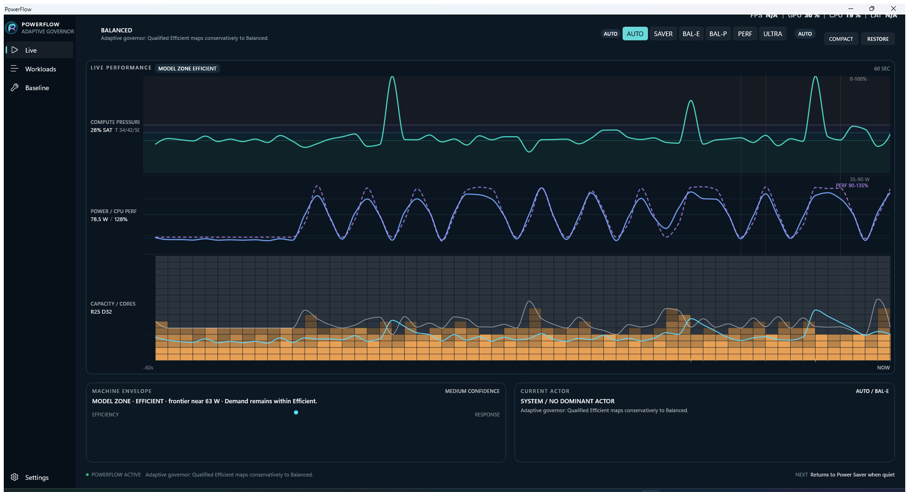

# PowerFlow

PowerFlow is a Windows CPU power manager that adjusts processor behavior to match the work the machine is doing. It combines live telemetry, a small set of measured power profiles, per-app importance, and a built-in machine baseline.



## How it works

PowerFlow can run automatically or hold a profile you choose manually.

In **Auto**, PowerFlow watches CPU demand and machine response, then moves between four profiles:

| Profile | Intended use | Windows plan | Core floor | EPP | Boost |
| --- | --- | --- | ---: | ---: | ---: |
| SAVER | Quiet / background work | Power Saver | 10% | 60 | 0 |
| BAL-E | Efficient everyday work | Balanced | 25% | 35 | 3 |
| BAL-P | More responsive work | Balanced | 50% | 20 | 3 |
| PERF | Sustained high performance | Balanced | 75% | 10 | 2 |

**ULTRA** is available as a manual profile. It uses Windows High Performance with a 100% core floor, EPP 10, and boost mode 2. Auto does not select ULTRA.

The Live view shows two related pieces of information:

- **Model Zone** shows how PowerFlow currently interprets demand.
- **Applied Profile** shows the profile that is actually active on Windows.

The model can move while a change is being evaluated, so these two values are intentionally shown separately.

## Live

The Live dashboard shows recent CPU activity, active-core behavior, package power, clock/performance data, model state, the active workload, and the profile PowerFlow is applying.

The graph keeps a rolling recent history so you can see both what the machine is doing now and how it got there.

## Workloads

Apps can be assigned one of three importance levels:

- **Low** ΓÇö background or non-urgent work. It cannot push Auto into PERF by itself.
- **Normal** ΓÇö the default for ordinary applications.
- **High** ΓÇö latency-sensitive work that should be allowed to reach higher performance sooner.

These rules influence Auto; they do not permanently lock the machine into a power mode.

## Baseline

**Baseline Machine** measures how this PC behaves across seven fixed configurations:

1. Windows Power Saver
2. Windows Balanced
3. PowerFlow SAVER
4. PowerFlow BAL-E
5. PowerFlow BAL-P
6. PowerFlow PERF
7. PowerFlow ULTRA

Each profile runs for five minutes. PowerFlow records idle power and CPU throughput at 1, 2, 4, 8, and 16 workers, then plots the curves and recommends a useful efficiency/performance point for the machine.

The baseline restores the processor policy that was active before the run when it finishes or is cancelled.

## Settings

Settings currently include:

- theme
- reduced motion
- start with Windows

App importance is managed from Workloads, and CPU profiles are managed from the main PowerFlow controls.

## Build

PowerFlow targets x64 Windows, .NET 8, and unpackaged WinUI 3.

```powershell
dotnet restore PowerFlow.sln
dotnet test PowerFlow.sln -c Release
dotnet build PowerFlow.sln -c Release
```

Run PowerFlow in the background:

```powershell
.\src\PowerFlow.App\bin\Release\net8.0-windows10.0.19041.0\win-x64\PowerFlow.App.exe --background
```

Open the dashboard through the running instance:

```powershell
.\src\PowerFlow.App\bin\Release\net8.0-windows10.0.19041.0\win-x64\PowerFlow.App.exe --dashboard
```

PowerFlow stores per-user configuration in `%LOCALAPPDATA%\PowerFlow\config.json`.

## More detail

- [Product behavior](docs/product.md)
- [Architecture](docs/architecture.md)
- [Design notes](docs/design/)

PowerFlow changes Windows power-plan and processor-policy settings. It does not change BIOS settings, CPU voltage, fan curves, or firmware.
